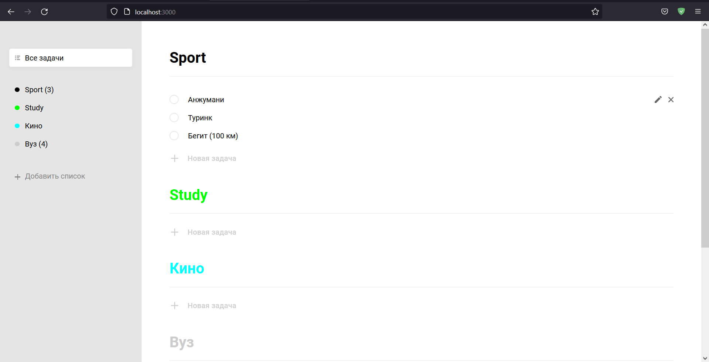
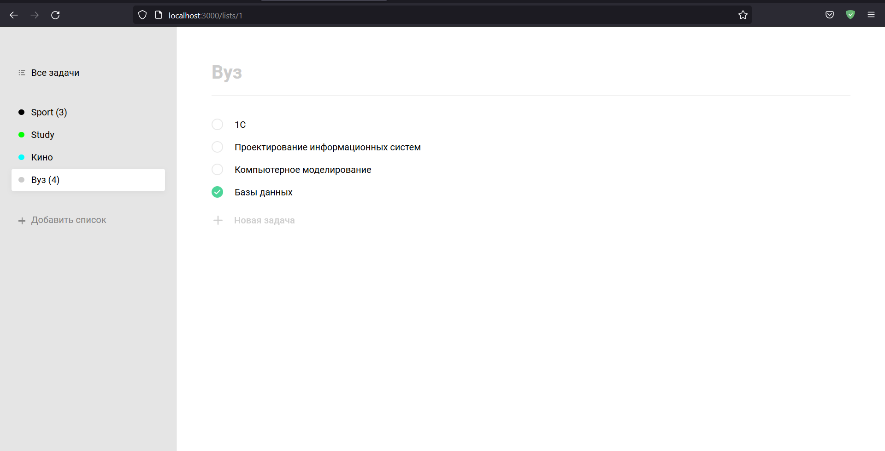
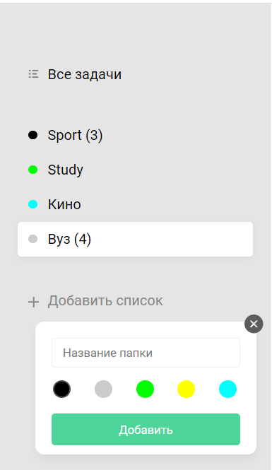
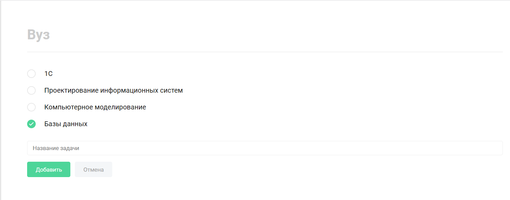

# Full-stack ToDo APP
## Stack
При разработке приложения были использованы следующие технологии:
###Back-end
+ **Express JS** - отвечает за создание сервера
+ **PostgreSQL** - система управления базой данных
+ **pg** - модуль, отвечающий за соединение сервера, написанного на Express, с базой данных PostgreSQL
+ **nodemon** - модуль, отвечающий за автоматическое обновление сервера при изменении файлов 
###Front-end
+ **React** - JavaScript библиотека для создания пользовательских интерфейсов
+ **React-router** - необходим для маршрутизации в веб-приложениях
+ **scss** - препроцессор для css, предназначенный для упрощения написания css кода
###Code quality
+ **eslint** - инструмент для анализа кода и выявления проблемных шаблонов, обнаруженных в коде JavaScript. В данном проекте используется конфиг от Airbnb
+ **prettier** - средство для форматирования кода

##База данных
Физическая модель базы данных:

Скрипт для создания данной БД можно посмотреть [тут](https://github.com/alexvolkovv/ReactToDoApp/blob/master/server/DataBaseCreatingScript.sql)

##Внешний вид
Главный экран:

Просмотр конкретного списка:

Добавление нового списка:

Добавление новой задачи:

